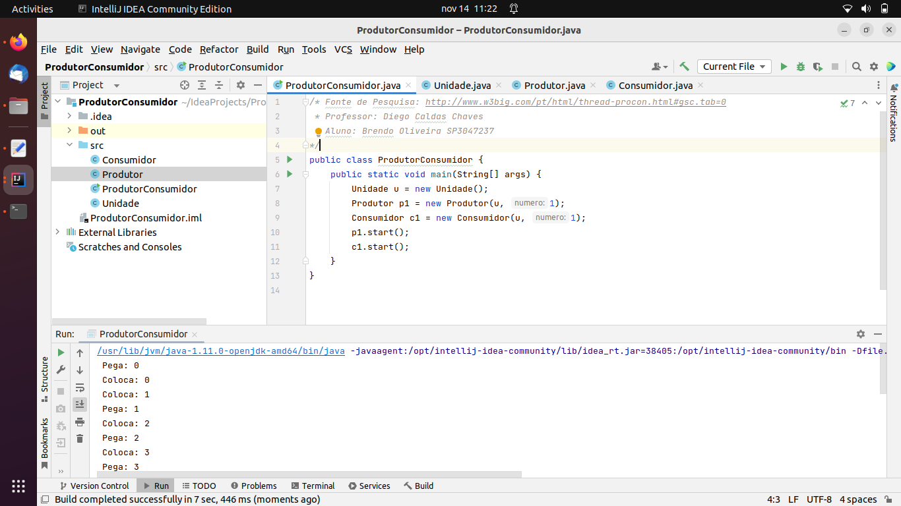

# LP3A5
## Instituto Federal de São Paulo
### Campus São Paulo

**Professor:** Diego Caldas Chaves

**Aluno:** Brendo Oliveira Gonçalves

**Prontuário:** SP3047237

**Sobre o Projeto**

Este projeto tem o intuito de solucionar o problema do Produtor-Consumidor. Neste problema, existe um buffer de memória, que é abastecido pelo Produtor e consumido pelo Consumidor. O grande impasse é a memória ficar totalmente cheia e o produtor continuar enviando informações (porém serão perdidas) ou  a memória ficar totalmente vazia e o consumidor não ter suprimento para trabalhar.
No nosso exemplo, resolvemos este problema através de um monitor, que no caso do JAVA, utiliza-se o synchronized

**Fonte**
. [W3Big](http://www.w3big.com/pt/html/thread-procon.html#gsc.tab=0)

*São Paulo - SP*
