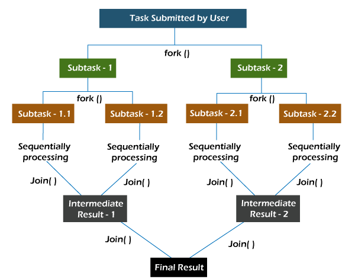
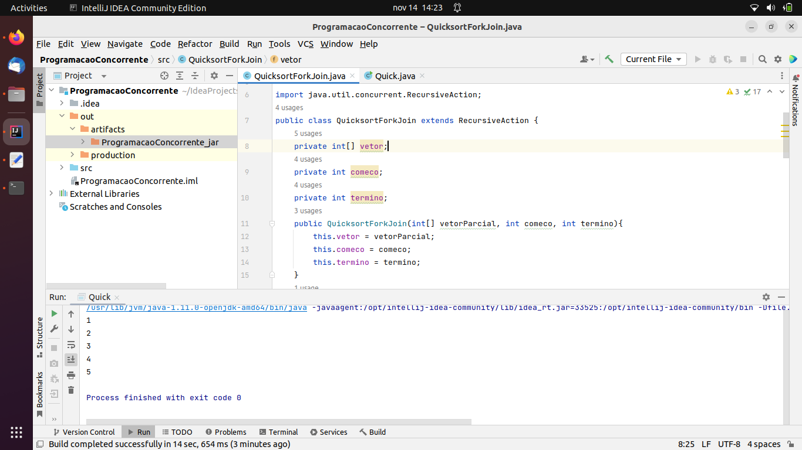
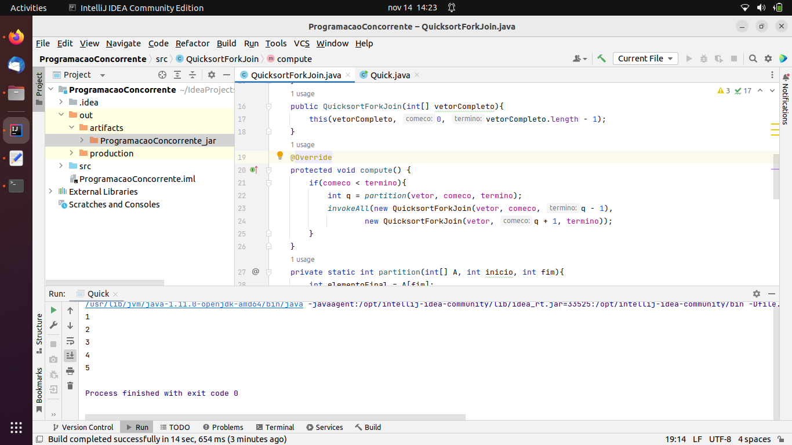

# LP3A5
## Instituto Federal de São Paulo
### Campus São Paulo

**Professor:** Diego Caldas Chaves

**Aluno:** Brendo Oliveira Gonçalves

**Prontuário:** SP3047237

#### Programação Paralela - ForkJoin

**Sobre o Projeto**

Este projeto tem o intuito de desenvolvover um projeto de programação paralela para fazer uma estrutura de ordenação. No nosso caso estamos utilizando a ordenação quicksort. Implementamos o framework ForkJoin.

*OBS.: Apesar de no projeto estar escrito Programação Concorrente, refere-se a programação Paralela*

**Fonte**
* [Blog Cyberini](https://www.blogcyberini.com/2018/09/quicksort-paralelo-em-java-fork-join.html)

*São Paulo - SP*
