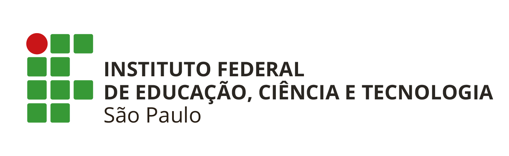

# LP3A5
## Instituto Federal de São Paulo
### Campus São Paulo

**Professor:** Diego Caldas Chaves

**Aluno:** Brendo Oliveira Gonçalves

**Prontuário:** SP3047237

#### Programação Paralela - ForkJoin

**Sobre o Projeto**

Este repositório contém as atividades da matéria Linguagem de Programação III, do curso de Análise e desenvolvimento de sistemas.

**Site Intitucional**
* [IFSP](https://spo.ifsp.edu.br/espaco-do-aluno)

*São Paulo - SP*
